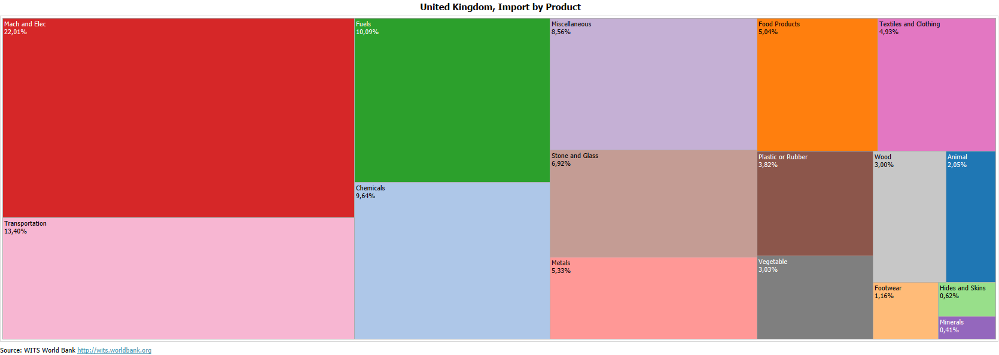
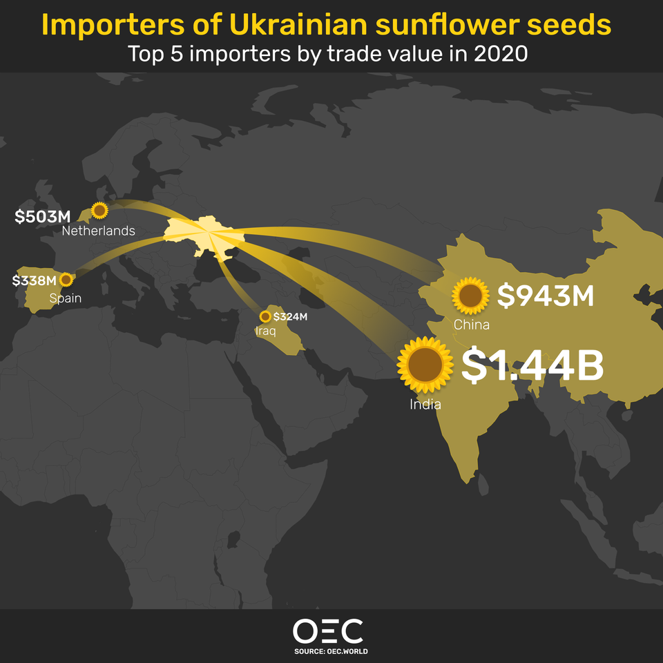
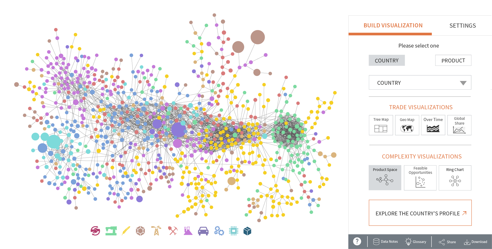

# Milestone 1 (8th April, 5pm)

## Dataset

We will be working on the International Trade Data dataset which was produced with the contributions of the European Union, United Nations and World Trade Organization. This dataset contains the import and export values(in USD) of more than 200 countries spread across more than 700 product goods, in 10  categories such as Food, Services, Chemicals, etc for a given year. We will discuss more about the dataset in the third Exploratory Data Analysis chapter. 

International Trade Data dataset is widely and freely available online from a number of different sources in slightly different formats. Among those, we decided to use the [dataset provided by Harvard](https://dataverse.harvard.edu/dataset.xhtml?persistentId=doi:10.7910/DVN/H8SFD2) due to the Harvard dataverse being better structured and organized than its alternatives. Compared to other datasets, it provides trade data over a longer time span, from 1962 to 2019. The dataset was also cleaned already by the [Harvard Growth Lab](https://growthlab.cid.harvard.edu) researchers using bilateral trade flows to account for inconsistent reporting which provides more reliable data. This method is called the Bustos-Yildrim Method. The raw data of this dataset originates from the [United Nations Statistical Division (COMTRADE)](https://comtrade.un.org/) and the [International Monetary Fund (IMF)](https://www.imf.org/en/Data). Choosing this dataset would save us time for the data cleaning and  support convenient implementation.  

## Problematic
With our implementation, we intend to show  complex trade networks between countries based on their import/export relations using easy to understand visuals. Our main motivation is that a user without any trade background should be able to discern which countries are the biggest importers/exporters for a given product and what products & how much of them each country imports/exports. The user should also easily see which countries are strongly linked (meaning trade a great amount with each other) through the visualized flow of products. This makes it so that our main target audience  is the broader public interested in world trade and economics without any past trade knowledge who wants to quickly understand the trade relations and their evolution between any two countries.

In order to achieve these tasks, we are thinking about implementing a visualization as follows:

- Our main screen will be an interactive world map showing the country borders. - We plan to have a 3D globe that you can spin around for this. Alternatively, we might also use a 2D plane.
- This map will be colorless except the country borders.
- We will assign colors to different product groups so that they will be visually distinct. Countries will be colored depending on their trade value in these products.
- There will be 2 modes: export and import; information on them will be visualized.
- The user will be able to select a single product from the sidebar to see only the colors (imports & exports) corresponding to that product.
- Selecting a country will clear the map of all colors unrelated to that country and the map will now show arrows representing the flow of trade going in and out of the selected country
- We will have a year slider at the bottom where the user can adjust to see world’s trade in different years.

Note that we might modify or extend our ideas during the implementation but we think the above plan is a solid general idea to use as a foundation.

## Exploratory Data Analysis

The dataset is divided into 3 types of tables. The main data table contains the trade infos and two classification tables containing the info about the products and the countries. There are 6 different types of data tables. All table types contain data ranging from 1962 up to 2019:

|Table|Description|
|-----|-----------|
|country_partner_sitcproduct2digit_year|Country - partner relations for SITC 2 digit products|
|country_partner_sitcproduct4digit_year_xxxx|Country - partner relations for SITC 4 digit products with xxxx between 1962 and 2019|
|country_partner_sitcproductsection_year|Country - partner relations for SITC product section|
|country_sitcproduct2digit_year|Country exports/imports for SITC 2 digit products|
|country_sitcproduct4digit_year|Country exports/imports for SITC 4 digit products|
|country_sitcproductsection_year|Country exports/imports for SITC product section|

| <b>Table 1 Types of Tables in Dataset </b>|

The products are divided into 3 categories: SITC product section, SITC 2 digit products and SITC 4 digit products.  Each category classifies all products into a sub-group of products. The SITC product section ranges from 0 to 9, the SITC 2 digit products ranges from 00 to 99 and the SITC 4 digit products ranges from 0000 to 9999. All 3 SITC types of products are inter-connected i.e. a product with SITC 4 digit product code “wxyz” is contained in the SITC 2 digit products of “wx” and is contained in the SITC product section of “w”.

For the next section, we used the dataset of “country_partner_sitcproduct4digit_year_2019” to have a first look at the available data. The dataset contains 4 085 596 entries where each entry corresponds to a trade realized between two countries. Note that since every trade consists of either an import or export between two countries, every trade is represented twice. For every trade, we have :

|Name|Description|
|----|-----------|
|location_id|ID identifying the importing or exporting country|
|partner_id|ID identifying the partner country|
|product_id|ID identifying the traded product|
|year|Year of the realized trade|
|export_value|Export value of the product in USD|
|import_value|Import value of the product in USD|
|sitc_eci|Economic complexity index|
|sitc_coi|Complexity outlook index|
|location_code|3-character ISO country code|
|partner_code|3-character ISO country code|
|sitc_product_code|SITC (Rev. 2) product code|

For this dataset, there are a total of 235 out of 258 countries that traded a total of 766 different SITC-4 digit products.
From this dataset, we can get some basic trading information for the year 2019. Below are tables describing by descending order of the value the highest exporting countries, the highest importing countries, the strongest pairs of country partners and the most traded SITC-4 digit products.

### Strongest countries according to descending export value
|location_id|export_value|location_name_short_en|Percentage|
|-----------|------------|----------------------|----------|
|43|2455821372827|China|13.467775|
|231|1632206655429|United States of America|8.951055|
|61|1492780104757|Germany|8.186437|
|114|717978619544|Japan|3.937409|
|77|554501869931|France|3.040900|

### Strongest countries according to descending import value
|location_id|import_value|location_name_short_en|Percentage|
|-----------|------------|----------------------|----------|
|231|2333016626976|United States of America|12.794311|
|43|1643417201652|China|9.012534|
|61|1165700201526|Germany|6.392724|
|81|658130564040|United Kingdom|3.609201|
|77|638637545124|France|3.502301|

### Strongest partners according to descending export/import value
|location_id|partner_id|value|export_country|import_country|Percentage|
|-----------|----------|-----|--------------|--------------|----------|
|43|231|387348497156|China|United States of America|2.124227|
|138|231|361292099796|Mexico|United States of America|1.981333|
|39|231|330853780633|Canada|United States of America|1.814409|
|231|39|288655180128|United States of America|Canada|1.582991|
|43|97|278149267556|China|Hong Kong|1.525376|

### Highest traded SITC-4 digit products according to descending value
|product_id|value|sitc_product_name_short_en|Percentage|
|----------|-----|--------------------------|----------|
|865|1090531439917|Crude petroleum and oils |5.980497|
|866|740376437519|Petroleum products, refined|4.060240|
|1314|732562848187|Passenger motor vehicles |4.017390|
|1432|676133162948|Special transactions|3.707928|
|1307|635348789903|Electronic microcircuits|3.484266|

## Related work
We have found trade visualizations such as: 
- [Trade Data Visualization WITS](https://wits.worldbank.org/trade-visualization.aspx)
- [What did Switzerland export in 2019?](https://atlas.cid.harvard.edu/explore?country=41&product=undefined&year=2019&productClass=HS&target=Product&partner=undefined&startYear=1995)
- [Importers of Ukrainian sunflower seeds 2020](https://preview.redd.it/ygwp4krup7q81.png?width=960&crop=smart&auto=webp&s=9a6dbfc9f9b36b46e0d8b286da737eb58737c7f7)

And of course the [The Atlas of Economic Complexity](https://atlas.cid.harvard.edu/) from where our data originates. In some of these works, for each country, the percentage of each category of products in terms of import or export is visualized as the area of the corresponding color, as shown in fig. 1. Some visualized the trade amounts between countries, as shown in fig. 2. Some visualized trade relationships between countries, yet failed to relate that to geography locations, as shown in fig. 3. 

**Fig 1.** - United Kingdom, Import by Product

**Fig 2.** - Top 5 importers of Ukraininan sunflower seeds

**Fig 3.** - Product space for exports

Apart from visualizing imports and exports between countries on a world map using colors, our novelty also lies in that we use  an interactive map together with the time series data that shows the evolution of trade throughout the years. In other words,  we will implement our original idea of showing the rise or decline of a country's trade as years went on.

 We took inspiration from the previously mentioned related works. We also analyzed the subreddit called r/dataisbeautiful where redditors produce great visualizations in a lot of different topics. While we don’t have any specific examples that we directly incorporate into our project, this [post](https://www.reddit.com/r/dataisbeautiful/comments/pt7gu3/earths_submarine_fiber_optic_cable_network_oc/) especially gave us the idea to use an interactive 3D globe.
