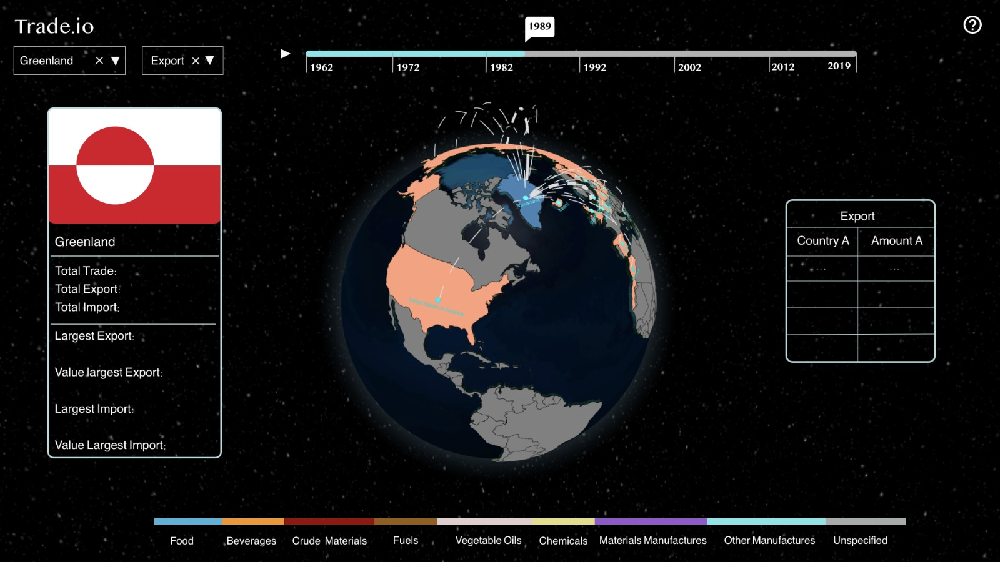

# Milestone 2 (6th May, 5pm)

**Fig 1.** - Representation of the final version of the website

This is a design created to show the visualization and functions of our final website.  Our main goal is to visualize the trade network between different countries without overwhelming the user. Components of this visualization are described below.

## Core Ideas

<ins>The Globe:</ins> This component is our main visualization tool to show the trade between countries. It is located at the center of the screen and it is fully interactable. It has two main modes, the first one is the default one where no country is selected. In this mode all countries are visible and colored according to their trade value. If the user hovers over a country then the country gets lifted and a info panel on the left appears. If the user then left-clicks inside the borders of the country then the globe enters the second mode. In this mode only the selected country and its top trade partners are colored with everything else being gray. Several arcs connect the selected country with its partners which depending on the trade amount take different sizes and colors. Many features about this component are already implemented in our website.

<ins>Time Slider:</ins> This component is located at the top of the webpage and displays a year range from 1962 to 2019. The user is able to pick a year on this slider which will then change all the data displayed to that of the selected year. 

<ins>Top Partners Panel:</ins> This panel is located on the right of the webpage. It is basically a list of 20(number might vary) countries that the currently selected country has the strongest trades with. On the top of the Panel the current selected Trade type(Export or Import) is displayed. A row of this list consists of a country’s name and the associated trade amount between it and the currently selected country. Rows are displayed in the order of  descending trade amount.

<ins>Selected Country Info Panel:</ins> This component is located on the left of the webpage. When a country is selected (by a mouse left-click or the Country selection menu), general information corresponding to that country is shown here in order to give users a broader look at the trade data regarding that country. The shown information is as follows: Flag and Name of the country, Total Trade amount, imports and exports, Product type of the largest Export and Import conducted by this country and their corresponding amounts. Exact information displayed here might be subject to change.

<ins>Country and Trade Type Selection Menus:</ins> These two menus exist on the top left of the webpage. The country selection is used to select a country on the map and is identical in functionality to simply left-clicking inside a country's borders. Trade type menu is right next to the country selection and is used to change the type of trade data displayed. There are two values that this component can have: Export and Import. The trade data shown on the other components will change to reflect the chosen one after it is selected.

## Extra Ideas

<ins>Product Categories Bar:</ins> This component is the multi-colored bar located at the bottom of the page. By default unspecified is selected and all the trade information is shown. If the user clicks on a product group then only the data corresponding to that group will be shown and the colors used in the globe component will change in order to convey a visual difference.

<ins>Play Button:</ins> This component is located just left of the time slider. When the play button is pressed the data(and by extension colors) displayed on the globe slowly change to show an impression of evolution through time to the user. This feature is listed as extra since the constant refresh of the globe might be unsightly if we can not find a fix for it.

## Tools and Lectures
We mostly use basic javascript and html for all our visual components except the globe. Our main tool for the globe is the Globe.gl library which is very customizable and allows us a range of visualization options. As for filtering and preparing our data, we used Python and Jupyter notebooks with the help of the Pandas library. For the lectures, we learned a lot from the initial javascript ones about how to get started. While we opted to do our data cleaning in python, the data lecture gave us many ideas about how to proceed with this procedure.The map lecture fits us perfectly but globe.gl already takes care of a big portion of what is told there. Finally, the color lecture is very important since we decide on the colors of everything on the globe. We decided to study it more thoroughly after the milestone to finalize our color selection.
