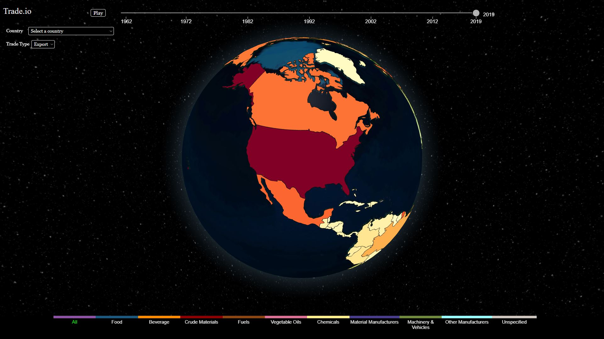

# Project of Data Visualization (COM-480)

| Student's name | SCIPER |
| -------------- | ------ |
| Gangloff Maximilian| 322220|
| Liu Ziwei| 336553 | 
| Soydinç Mert| 321131 | 

[Milestone 1](#Milestone-1) • [Milestone 2](#Milestone-2) • [Milestone 3](#Milestone-3)

**[https://com-480-data-visualization.github.io/data-visualization-project-2022-Tradeio](https://com-480-data-visualization.github.io/datavis-project-2022-tradeio/)**

## Milestone 1 (8th April, 5pm)

[Milestone 1 - Report](./Milestones/Milestone1.md)

## Milestone 2 (7th May, 5pm)

[Milestone 2 - Report](./Milestones/Milestone2.md)


## Milestone 3 (4th June, 5pm)

[Milestone 3 - Process book](./Milestones/ProcessBook.pdf)


## Technical setup

The project is organized as follows:
* [`dataset/`](./dataset): Directory containing the data required by the website. Either created by the  [`data_creation.ipynb`](./data_creation.ipynb) or acquired from our sources. 
* [`images/`](./images): Directory containing images used for the website and several milestone reports.
* [`Milestones/`](./): Directory containing our reports for all milestones. 

Since the data has already been processed and is saved into ```.json``` files already, there is no need to download new data. However, if one wants to recreate or change these files, then the original ```.csv``` files must be downloaded from the [dataset provided by Harvard](https://dataverse.harvard.edu/dataset.xhtml?persistentId=doi:10.7910/DVN/H8SFD2) and place its files into the [`dataset/dataverse_files`](./dataset/dataverse_files/) according to its corresponding [README](./dataset/dataverse_files/data_placeholder.md).

## Installation and Deployment

Simply pull the project into your local and make sure you also pull all the contents of the dataset folder.
Then, you will need a local Server to run the code as our logic uses server specific instructions such as fetch. We recommend using the Live server extension of VSCode.

## Source code

All logic components of our project are organized as follows:

* [`Globe.js`](../../globe.js): Main logic file of our website. Prepares the globe and coordinates all others javascript files.
* [`index.html`](../../index.html): Main HTML file of our website.
* [`helpers.js`](../../helpers.js): A file that contains all the helper functions that are used in globe.js
* [`slider.js`](../../slider.js): A file that contains logic for the slider.
* [`EventHandlers.js`](../../EventHandlers.js): A file that contains all the Event handlers that are used in globe.js and index.html
* [`styles.css`](../../styles.css): A basic css file.

## Website
The website is available at: **[TradeIO website](https://com-480-data-visualization.github.io/datavis-project-2022-tradeio/)**

Below is a short Screencast of our website. Simply click on the image to open it :)

[](https://www.youtube.com/watch?v=EzGVMe7kMHk)


